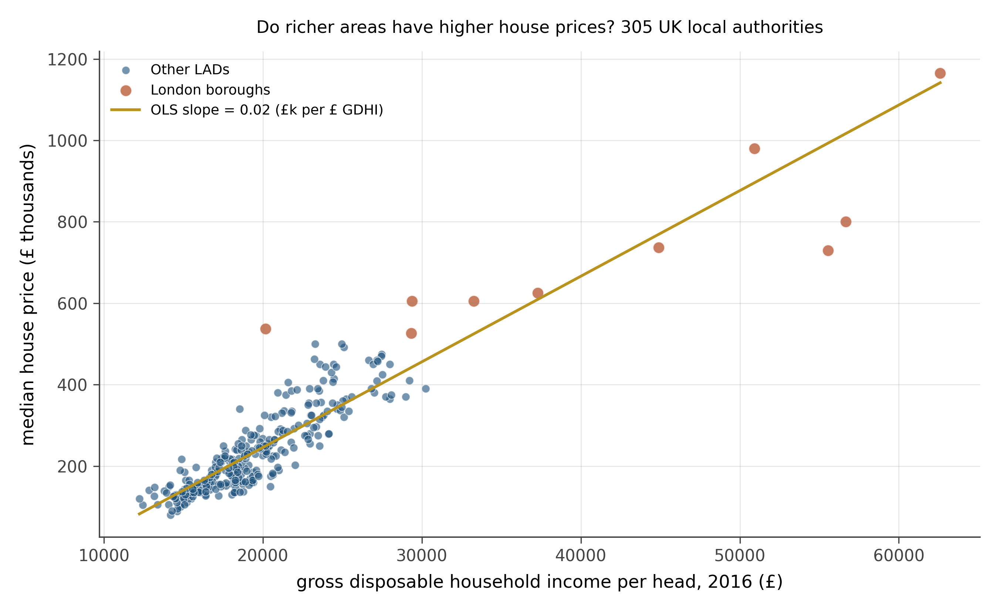

::: {.poi-chapter-card}

Time
~50 minutes

Prerequisites
Chapters 4-5

Format
10 scatter-plot diagnostic problems

Skill being practiced
<ul>
<li>Reading slope direction and rough magnitude from a scatter</li>
<li>Recognizing when a linear regression is the wrong tool</li>
<li>Spotting heteroskedasticity, leverage, and Simpson-style pooling errors</li>
<li>Distinguishing fit quality from slope estimate</li>
</ul>

:::

Most of what a regression tells you is visible in the scatter plot before you ever compute a coefficient. This workbook trains you to read it. Ten scatter plots follow. For each one, the question is what a regression *would* tell you if you ran it, and what diagnostic problems would show up if you looked at the residuals.

The chapters on regression itself are coming in Part II. The skill this workbook builds will make those chapters easier, because by then you will already know what a good regression looks like.

## Warmups

### Problem 1: Read the slope

{#fig-wb2-q1}

1. From the cloud alone, estimate the slope direction and rough magnitude. If $x$ increases by one unit, $y$ increases by approximately how much?
2. What is your eyeball estimate of the correlation $r$?
3. Would the OLS line lie close to the data or pass through high-residual regions?

::: {.callout-note collapse="true" title="Solution to Problem 1"}

**Slope.** Positive. Eyeballing the trend: when $x$ goes from 0 to 10, $y$ goes from about 1 to about 8, a slope of roughly 0.7. The actual slope used to generate this data is 0.7.

**Correlation.** The cloud is tight around the line, with modest noise. $r \approx 0.85$ to $0.92$. (Actual: 0.89.)

**OLS line.** Would lie very close to the data. Residuals would be small and uniformly scattered. No diagnostic concerns.

:::

### Problem 2: Linear or curved?

{#fig-wb2-q2}

1. Is the underlying relationship linear?
2. Would fitting a straight line through this data be appropriate?
3. What pattern would you expect in the residuals (residuals vs fitted values)?

::: {.callout-note collapse="true" title="Solution to Problem 2"}

**Linear?** No. The data curves. $y$ rises, levels off, and starts to fall. The shape is quadratic.

**Linear fit appropriate?** Not by itself. The OLS line gets the *average* slope across the range but systematically over-predicts at the extremes (where the truth has bent down) and under-predicts in the middle (where the truth peaks above the line). The slope coefficient is technically defined and computable, but its interpretation as "the effect of $x$ on $y$" is misleading because the effect changes across the range.

**Residual pattern.** A residuals-vs-fitted plot would show a smile or a frown: residuals positive in the middle, negative at both ends. That curved pattern in the residual plot is the canonical signature of a missing nonlinear term. The fix is usually to add $x^2$ as a regressor (or to log-transform $y$ if appropriate, or to fit a more flexible smoother).

:::

## Core problems

### Problem 3: Heteroskedastic errors

{#fig-wb2-q3}

1. What is the slope of the trend?
2. What is unusual about the *spread* of the residuals across the range of $x$?
3. What would a plot of residuals vs. fitted values look like?
4. Practical consequence for inference?

::: {.callout-note collapse="true" title="Solution to Problem 3"}

**Slope.** Positive, roughly 0.6.

**Unusual feature.** The cloud is tight on the left and fans out toward the right. The residual variance increases with $x$. This is *heteroskedasticity*: the spread of the errors is not constant across the range.

**Residual plot.** A plot of residuals vs fitted values would show a wedge or a megaphone: small spread on the left, large spread on the right. Sometimes called a "trumpet" pattern. The mean residual is zero everywhere (the regression line still passes through the cloud appropriately), but the variance of the residual depends on the predicted value.

**Consequence.** The slope estimate is still unbiased; OLS is consistent for the slope even under heteroskedasticity. *Standard errors* on the slope are wrong, however. Conventional OLS standard errors assume constant residual variance and underestimate uncertainty when the variance grows with $x$. The fix is robust standard errors (Huber-White, also called HC0/HC1/HC2/HC3) which give the right uncertainty without assuming homoskedasticity. We will return to this in chapter 34.

:::

### Problem 4: A high-leverage outlier

![Fifty points cluster around a slope-0.5 line near x in [0, 10]. One additional point sits at (25, 12).](../../pictures/figures/output/fig_wb2_q4.png){#fig-wb2-q4}

1. Where is the OLS line going to fall, with vs without the outlier?
2. What is the *leverage* of the outlier point? What is its *residual*?
3. What is the practical implication?

::: {.callout-note collapse="true" title="Solution to Problem 4"}

**With vs without.** Without the outlier, the OLS line fits the cluster of 50 points around its true slope of 0.5. Adding the outlier (which sits at high $x$ and high $y$, but lower than the line at slope 0.5 would predict at $x = 25$) tilts the line *downward*: the outlier's high-$x$ position gives it a long lever arm, and the line is pulled toward it.

**Leverage.** Very high. Leverage measures how far an observation's $x$-value is from the mean of $x$. A point at $x = 25$ when the rest of the data lives in $[0, 10]$ has dramatically more leverage than any other observation.

**Residual.** Modest. The point sits a few units above what a slope-0.5 line through the cluster would predict at $x = 25$. The residual is small relative to the data spread; the outlier looks "fine" by residual size alone.

**Implication.** This is the dangerous combination: high leverage plus modest residual. The point is not flagged as an outlier by ordinary residual diagnostics, yet it is single-handedly setting the slope. The diagnostic for this is *Cook's distance* (or DFBETAS), which combines leverage and residual size. A standard rule of thumb is that any observation with Cook's distance above $4/n$ deserves a second look. We will see this formally in chapter 19.

:::

### Problem 5: No relationship

{#fig-wb2-q5}

1. What is the correlation $r$ approximately?
2. What slope does OLS produce on this data?
3. Is the slope statistically significant?
4. What lesson generalizes from this problem?

::: {.callout-note collapse="true" title="Solution to Problem 5"}

**Correlation.** Approximately zero. With $n = 80$ and no real relationship, the empirical $r$ will be close to zero, almost certainly within $\pm 0.2$ by chance.

**OLS slope.** Whatever number happens to fall out. With $n = 80$ and a true zero relationship, the slope estimate has a sampling distribution centered at zero with some standard error. A particular sample might give a slope of 0.04, or -0.07, or 0.11. None of these would be meaningful.

**Significance.** Almost certainly not. The 95% confidence interval would include zero, and a $t$-test for the slope being different from zero would not reject. With 80 independent random points, the slope is consistent with zero.

**Lesson.** OLS will *always* give you a slope estimate, even when there is no relationship to find. The slope is a deterministic function of the data; nothing about it tells you whether it is meaningful. The standard error and the confidence interval are what tell you whether the slope is distinguishable from noise. This is the heart of inferential statistics, which the next workbook will drill explicitly.

:::

### Problem 6: Two clusters, opposite story

{#fig-wb2-q6}

1. What is the within-group slope?
2. What does pooled OLS produce?
3. Why are the answers different?
4. What is the right move?

::: {.callout-note collapse="true" title="Solution to Problem 6"}

**Within-group slope.** Positive, roughly 0.5, for both groups separately.

**Pooled slope.** Negative or near zero. The blue group sits at high $y$ and low $x$; the rust group at low $y$ and high $x$. Pooled, the line through both clusters tilts the wrong way.

**Why different.** This is *Simpson's paradox*. The within-group relationship is positive, but the between-group difference (groups at different overall levels of $x$ and $y$) creates a negative pooled relationship that is an artifact of the group-level confounding.

**Right move.** Add the group as a covariate. A regression of $y$ on $x$ and a group dummy (or, equivalently, a separate intercept for each group) recovers the within-group slope of 0.5. If the group is observable, controlling for it is the fix. If the group is unobservable but the data has a panel structure (each unit observed multiple times), fixed effects can perform the same correction. We will see both moves explicitly in chapters 18 and 39.

:::

## Stretch

### Problem 7: Ceiling effect

{#fig-wb2-q7}

1. Describe what the data looks like.
2. Is OLS the right tool here?
3. What kind of model is more appropriate?

::: {.callout-note collapse="true" title="Solution to Problem 7"}

**Description.** Linear at low $x$, then a flat ceiling at $y = 100$ for high $x$. The underlying linear relationship is $y = 20 + 8x$, but every observation where the predicted $y$ would be above 100 is censored to 100.

**OLS.** Not the right tool. Fitting OLS through the data gives a slope smaller than the true 8, because the censored region pulls the line downward. The standard errors are also wrong because the residuals at high $x$ are systematically negative (capped at 100 means observations that would be higher are pulled to 100, so their residuals from any non-flat line are negative).

**Right model.** A *Tobit* model (also called censored regression) handles this case: it estimates the underlying linear relationship while accounting for the censoring at the upper bound. In R, the `tobit` or `censReg` packages; in Stata, the `tobit` command. Tobit models will appear in the advanced section of Part III. The diagnostic for this problem is to plot the residuals: if many of them at high fitted values are pinned at zero or strongly negative, suspect censoring.

The same problem appears in reverse for floor effects (data bounded below), and in survival analysis (data right-censored at the time of measurement). The general lesson: when you see boundary effects in the data, OLS is structurally biased and a model that explicitly handles the bound is needed.

:::

### Problem 8: Same slope, different fit quality

{#fig-wb2-q8}

1. Which slope is more reliably estimated?
2. What does $R^2$ tell you that the slope coefficient does not?
3. Which model would give better predictions for new observations?

::: {.callout-note collapse="true" title="Solution to Problem 8"}

**Reliable estimation.** The left panel. Both scatters have the same slope estimate (0.5) and the same number of observations, but the residual variance is much smaller on the left. Smaller residual variance means smaller standard errors on the slope, which means a tighter confidence interval and a more reliable estimate of the slope itself.

**$R^2$ vs slope.** The slope coefficient tells you the *direction and magnitude* of the relationship. $R^2$ tells you what *fraction* of the variance in $y$ is explained by $x$. A relationship can be strong (high slope) but noisy (low $R^2$), or weak (small slope) but precise (high $R^2$). They are independent dimensions of the regression.

**Predictions.** The left model would give better predictions for new observations, because the prediction interval (which accounts for residual variance) is much narrower. For a given $x$, the left model's prediction is in the right ballpark; the right model's prediction has substantial uncertainty.

**Lesson.** Never report a regression coefficient without reporting the standard error or confidence interval. The slope alone tells you nothing about how well-determined it is. A coefficient of 0.5 ± 0.05 and a coefficient of 0.5 ± 0.4 are very different findings and should be communicated as such. Coefficient plots from chapter 8 are the visual representation of this distinction.

:::

## Real UK data

### Problem 9: Income and house prices across British local authorities

{#fig-wb2-q9}

1. What is the direction of the relationship? Does it look linear?
2. Estimate the slope by eye. If GDHI increases by £5,000, by roughly how much does the median house price change?
3. The highlighted dots form a cluster at the upper right. What is special about them? What does their presence tell you about the reliability of the OLS line for non-London areas?
4. Would you expect this relationship to be causal? In which direction, if any?

::: {.callout-note collapse="true" title="Solution to Problem 9"}

**Direction.** Strongly positive. Local authorities with higher disposable incomes tend to have higher house prices. The OLS slope is approximately 0.021 £ thousands per £1 of GDHI, which translates to roughly £105,000 in median house price for every £5,000 increase in GDHI per head. The relationship is broadly linear but with meaningful scatter.

**Slope by eye.** The figure prints the fitted slope. A £5,000 increase in GDHI corresponds to roughly a £100,000–110,000 increase in median house price across the full sample. For non-London areas the relationship is tighter and the slope would be modestly different.

**The London cluster.** Ten London boroughs sit far above the main cloud. Their GDHI is high, but their house prices are dramatically higher still, far more than the rest of the line would predict at those income levels. This is a form of influence: a cluster of observations that is not well-described by the fitted line for the rest of the sample. The OLS line tries to accommodate them, pulling the slope steeper than it would be for non-London England alone. London is genuinely a different housing market, driven by global capital flows, restrictive planning, and its role as a financial centre. Treating it and Hartlepool as observations from the same data-generating process is a modeling choice worth questioning.

**Causality.** The relationship runs in both directions and through many channels. High incomes allow residents to bid more for housing, pushing prices up. High prices attract high earners who can afford them. Both income and house prices reflect common drivers: productivity, access to infrastructure, and local economic history. A scatter plot is the beginning of the question, not the answer. Establishing that income *causes* higher prices would require a source of variation in income that is unrelated to anything else that affects housing demand: a natural experiment or credibly exogenous policy change.

:::

### Problem 10: Income and health deprivation in English neighbourhoods

{#fig-wb2-q10}

1. Is the relationship positive or negative? Strong or weak?
2. The correlation coefficient is printed on the figure. What does it tell you about the fit?
3. The cloud is dense and slightly curved near the bottom left. What does this suggest about using a straight line here?
4. A researcher concludes: "poverty causes poor health in England." Does this scatter plot support that conclusion? What additional evidence would you need?

::: {.callout-note collapse="true" title="Solution to Problem 10"}

**Direction and strength.** Strongly positive. Areas with more income deprivation also tend to have worse health outcomes. The correlation shown on the figure is approximately 0.80, indicating a strong linear association.

**What the correlation tells you.** A correlation near 0.80 means the linear model explains roughly 64% of the variance in health deprivation scores. That is a strong association. It also means around 36% of the variation in health is not explained by income deprivation alone. Other factors (environmental quality, access to primary care, local housing conditions) account for the remainder.

**Curvature and fan shape.** The bottom-left corner of the cloud is compact, while the scatter fans out toward higher deprivation scores. This pattern (wider residuals at higher values) is mild heteroskedasticity, and there may be slight curvature near the upper end. A log transform of one or both variables, or a flexible smoother, might improve fit. For workbook purposes the straight line captures the dominant pattern, but a working analyst would examine residual plots before publishing.

**Causality.** The scatter plot shows correlation, not causation. It is consistent with poverty causing poor health, and also consistent with poor health causing poverty (illness reduces earnings), with both driven by common causes (geography, education, or deindustrialisation), or some combination. To establish that poverty causes poor health, you would need an exogenous source of income variation: a policy that raised incomes in some areas but not others for reasons unrelated to health. This is exactly the kind of question Part III of the book addresses. The scatter plot opens the inquiry; it does not close it.

:::

## What you practiced

You have read ten scatter plots and identified what each tells you about the regression that would be fit through it. The pattern is:

1. Look at the cloud. Estimate slope direction and rough magnitude before computing.
2. Ask whether a straight line is the right shape.
3. Ask whether the spread of the residuals is constant across $x$.
4. Look for outliers, especially high-leverage outliers.
5. Look for clusters that should be modeled separately.
6. Look for boundary effects (ceilings, floors, censoring).
7. Distinguish slope from fit quality.

When you reach the regression chapters in Part II, every diagnostic plot you encounter will be one of these patterns. The skill from this workbook is what makes the formal regression machinery feel natural rather than alien.
